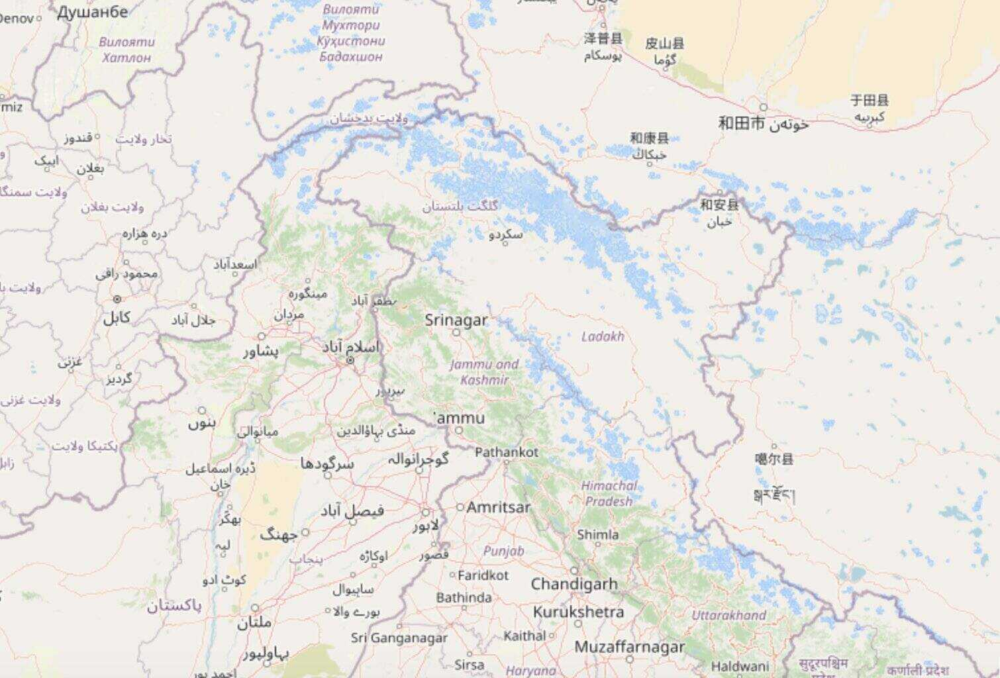

# India Boundary Corrector

**[Config Editor](https://ramseraph.github.io/india_boundary_corrector/)** | **[Examples](https://ramseraph.github.io/india_boundary_corrector/examples/)** - See the boundary corrections in action across Leaflet, MapLibre, and OpenLayers.

A set of JavaScript packages to display maps with India's official boundaries, correcting the disputed territory representations commonly found in international map tile providers.

## The Problem

Most international map tile providers (OpenStreetMap, Carto, etc.) show disputed territories like Kashmir and Arunachal Pradesh with boundaries that don't match India's official position. This can be problematic for applications targeting Indian users or requiring compliance with Indian mapping regulations.

## The Solution

This monorepo provides map library integrations that modify raster tiles directly to correct boundaries:
1. **Delete corrections**: Apply median blur along incorrect boundary lines to mask them
2. **Add corrections**: Draw the correct India boundaries on top

The corrections use different data sources based on zoom level:
- **Lower zoom (< threshold)**: Natural Earth data corrections (`to-add-ne`, `to-del-ne` layers)
- **Higher zoom (≥ threshold)**: OpenStreetMap data corrections (`to-add-osm`, `to-del-osm` layers)

All boundary data is packaged in a single PMTiles file. Line widths scale dynamically with zoom level for consistent appearance.

### Before


### After



## Packages

| Package | Description |
|---------|-------------|
| [@india-boundary-corrector/leaflet-layer](./packages/leaflet-layer) | Leaflet TileLayer with built-in corrections |
| [@india-boundary-corrector/openlayers-layer](./packages/openlayers-layer) | OpenLayers TileLayer with built-in corrections |
| [@india-boundary-corrector/maplibre-protocol](./packages/maplibre-protocol) | MapLibre custom protocol for corrected tiles |
| [@india-boundary-corrector/service-worker](./packages/service-worker) | Service worker for automatic tile interception |
| [@india-boundary-corrector/layer-configs](./packages/layer-configs) | Pre-built layer configurations |
| [@india-boundary-corrector/data](./packages/data) | PMTiles data with boundary corrections |
| [@india-boundary-corrector/tilefixer](./packages/tilefixer) | Core tile correction engine |

## Quick Start

### Leaflet - IndiaBoundaryCorrected TileLayer

```javascript
import L from 'leaflet';
import { extendLeaflet } from '@india-boundary-corrector/leaflet-layer';

extendLeaflet(L);

const map = L.map('map').setView([20.5937, 78.9629], 4);

// Use L.tileLayer.indiaBoundaryCorrected instead of L.tileLayer
L.tileLayer.indiaBoundaryCorrected('https://{s}.tile.openstreetmap.org/{z}/{x}/{y}.png', {
  attribution: '© OpenStreetMap contributors',
  // layerConfig: 'osm-carto', // Optional: auto-detected from URL
}).addTo(map);
```

### OpenLayers - Corrected TileLayer

```javascript
import Map from 'ol/Map';
import View from 'ol/View';
import { IndiaBoundaryCorrectedTileLayer } from '@india-boundary-corrector/openlayers-layer';

const map = new Map({
  target: 'map',
  layers: [
    new IndiaBoundaryCorrectedTileLayer({
      url: 'https://{a-c}.tile.openstreetmap.org/{z}/{x}/{y}.png',
      // layerConfig: 'osm-carto', // Optional: auto-detected from URL
    }),
  ],
  view: new View({ center: [78.9629, 20.5937], zoom: 4 }),
});
```

### MapLibre - Custom Protocol

```javascript
import maplibregl from 'maplibre-gl';
import { CorrectionProtocol } from '@india-boundary-corrector/maplibre-protocol';

// Register the corrections protocol
const protocol = new CorrectionProtocol();
maplibregl.addProtocol('corrections', protocol.tile);

const map = new maplibregl.Map({
  container: 'map',
  style: {
    version: 8,
    sources: {
      basemap: {
        type: 'raster',
        // Prefix tile URL with 'ibc://' to apply corrections
        tiles: ['ibc://https://a.tile.openstreetmap.org/{z}/{x}/{y}.png'],
        tileSize: 256,
      },
    },
    layers: [{ id: 'basemap', type: 'raster', source: 'basemap' }],
  },
  center: [78.9629, 20.5937],
  zoom: 4,
});
```

### Service Worker (Any Map Library)

The service worker automatically intercepts tile requests and applies corrections transparently:

```javascript
import { CorrectionServiceWorker } from '@india-boundary-corrector/service-worker';

// Register the service worker
const sw = new CorrectionServiceWorker('/sw.js');
await sw.register();

// Now use any map library normally - tiles are corrected automatically
const map = L.map('map').setView([20.5937, 78.9629], 4);
L.tileLayer('https://{s}.tile.openstreetmap.org/{z}/{x}/{y}.png').addTo(map);
```

> **Note**: The service worker approach intercepts all matching tile requests globally. Unlike the library-specific integrations, you cannot selectively disable corrections for specific tile layers.

## Supported Tile Providers

Built-in configurations for:
- **CartoDB Dark** (`cartodb-dark`): CartoDB dark tiles
- **CartoDB Light** (`cartodb-light`): CartoDB light/voyager tiles
- **OpenTopoMap** (`open-topo`): OpenTopoMap tiles
- **OSM Carto** (`osm-carto`): OpenStreetMap standard tiles
- **OSM HOT** (`osm-hot`): Humanitarian OpenStreetMap tiles

Custom configurations can be created for other tile providers using `LayerConfig`.

## LayerConfig Options

| Option | Type | Default | Description |
|--------|------|---------|-------------|
| `id` | string | required | Unique identifier |
| `startZoom` | number | 0 | Minimum zoom to start rendering |
| `zoomThreshold` | number | 5 | Zoom level to switch NE/OSM data |
| `tileUrlTemplates` | string \| string[] | [] | URL templates for matching tiles (e.g., `https://{s}.tile.example.com/{z}/{x}/{y}.png`) |
| `lineWidthStops` | object | { 1: 0.5, 10: 2.5 } | Zoom-to-width interpolation map |
| `lineStyles` | array | [{ color: 'green' }] | Array of line styles to draw |
| `delWidthFactor` | number | 1.5 | Multiplier for deletion line width |

### URL Template Placeholders

| Placeholder | Description |
|-------------|-------------|
| `{z}` | Zoom level |
| `{x}` | Tile X coordinate |
| `{y}` | Tile Y coordinate |
| `{s}` | Subdomain - Leaflet style (optional) |
| `{a-c}` | Subdomain - OpenLayers style |
| `{r}` | Retina suffix (optional) |

### LineStyle Object

| Property | Type | Default | Description |
|----------|------|---------|-------------|
| `color` | string | required | Line color (CSS color) |
| `widthFraction` | number | 1.0 | Width as fraction of base width |
| `dashArray` | number[] | - | Dash pattern (omit for solid) |
| `alpha` | number | 1.0 | Opacity (0 = transparent, 1 = opaque) |
| `startZoom` | number | layerConfig.startZoom | Minimum zoom for this style |
| `endZoom` | number | Infinity | Maximum zoom for this style |

## Data Sources

- **OpenStreetMap**: Boundary relations for India, Pakistan, and disputed territories
- **Natural Earth**: Admin 0 Countries (standard and India-perspective versions)

## Credits

This solution was originally conceived by [@planemad](https://github.com/planemad) in [osm-in/osm-in.github.io#38](https://github.com/osm-in/osm-in.github.io/issues/38#issuecomment-706880270).

## License

Code: [Unlicense](https://unlicense.org/)

Data: See [packages/data/LICENSE](./packages/data/LICENSE) for OpenStreetMap (ODbL) and Natural Earth (Public Domain) data licenses.
